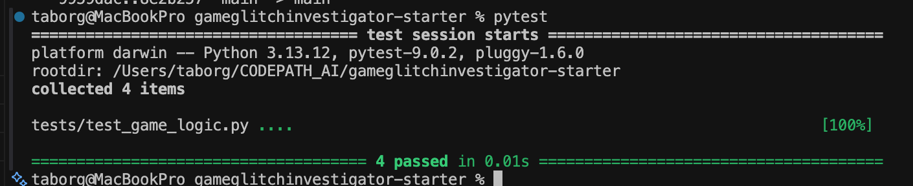

# 🎮 Game Glitch Investigator: The Impossible Guesser

## 🚨 The Situation

You asked an AI to build a simple "Number Guessing Game" using Streamlit.
It wrote the code, ran away, and now the game is unplayable. 

- You can't win.
- The hints lie to you.
- The secret number seems to have commitment issues.

## 🛠️ Setup

1. Install dependencies: `pip install -r requirements.txt`
2. Run the broken app: `python -m streamlit run app.py`

## 🕵️‍♂️ Your Mission

1. **Play the game.** Open the "Developer Debug Info" tab in the app to see the secret number. Try to win.
2. **Find the State Bug.** Why does the secret number change every time you click "Submit"? Ask ChatGPT: *"How do I keep a variable from resetting in Streamlit when I click a button?"*
3. **Fix the Logic.** The hints ("Higher/Lower") are wrong. Fix them.
4. **Refactor & Test.** - Move the logic into `logic_utils.py`.
   - Run `pytest` in your terminal.
   - Keep fixing until all tests pass!

## 📝 Document Your Experience

### Game Purpose

This project is a Streamlit number-guessing game. The player tries to guess a hidden number within a limited number of attempts, while the app provides feedback such as whether the guess was too high, too low, or correct. The "Game Glitch Investigator" theme turns the app into a debugging exercise where the goal is not only to play the game, but also to identify and fix broken AI-generated logic.

### Bugs Found

- The hint direction was reversed. When the player guessed a number that was too high, the game told them to go higher, and when the guess was too low, it told them to go lower.
- The main game logic was defined directly inside `app.py`, which made it harder to test and refactor cleanly.
- The existing pytest file did not match the real return value of `check_guess()`. The function returns a tuple of `(outcome, message)`, but the tests were only checking for a single string.
- Pytest could not import `logic_utils.py` during collection because the test file did not add the project root to the import path in this environment.

### Fixes Applied

- Moved `check_guess()` out of `app.py` and into `logic_utils.py` so the game logic is separated from the Streamlit UI code.
- Corrected the high/low hint bug so that:
  - a guess above the secret returns `Too High` with `Go LOWER!`
  - a guess below the secret returns `Too Low` with `Go HIGHER!`
- Updated `app.py` to import `check_guess` from `logic_utils.py` instead of using an inline copy.
- Fixed `tests/test_game_logic.py` so the tests unpack and verify both parts of the tuple returned by `check_guess()`.
- Added a regression test that specifically checks the bug that was fixed, ensuring the hint text now matches the guess direction.
- Updated the test file so `pytest tests/test_game_logic.py` runs successfully in this project setup.

## 📸 Demo

- 

## Pytest Result
- 

## 🚀 Stretch Features

- [ ] [If you choose to complete Challenge 4, insert a screenshot of your Enhanced Game UI here]
